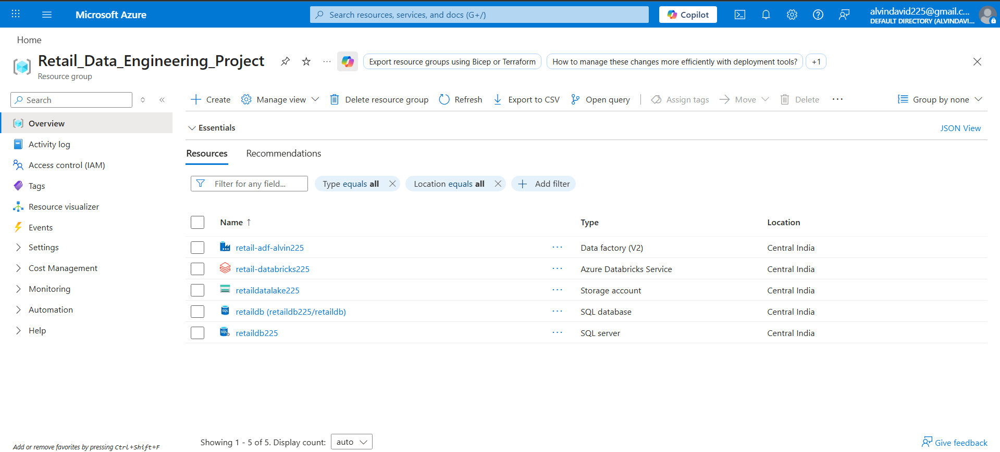
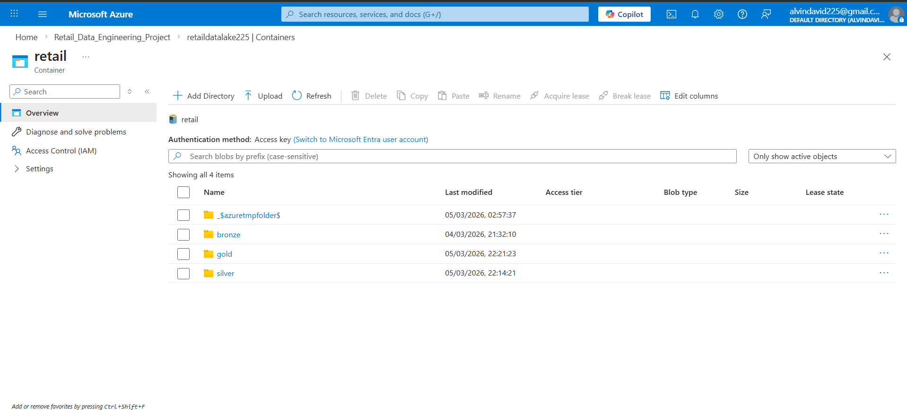
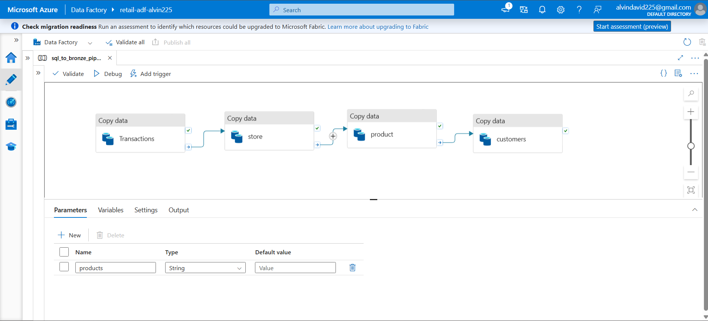
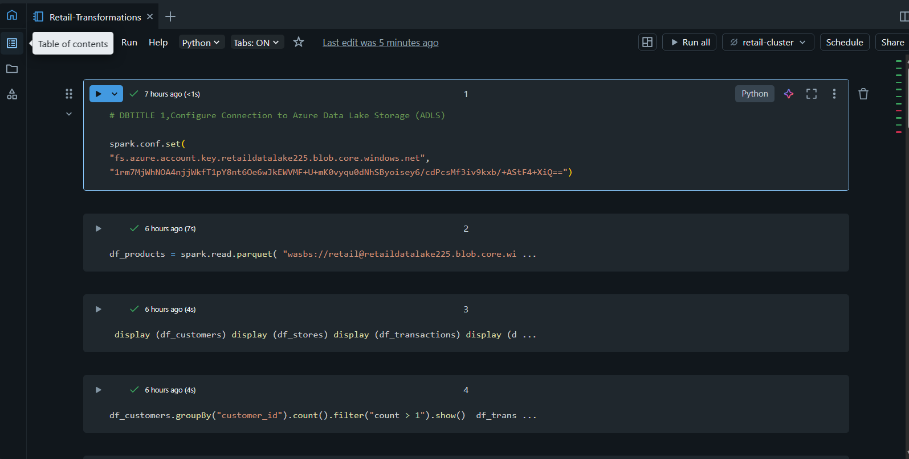
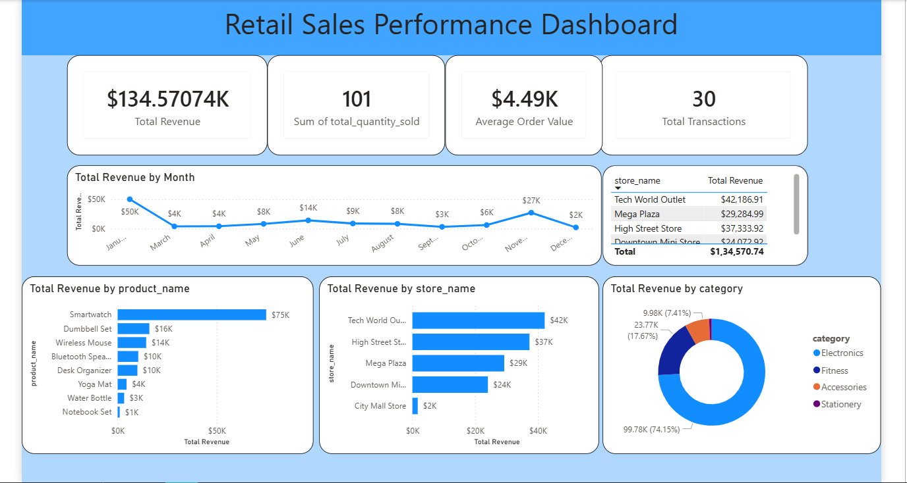

# Azure Retail Data Engineering Pipeline

This project demonstrates an end-to-end data engineering pipeline built on Microsoft Azure to process and analyze retail sales data.  
The solution follows the **Medallion Architecture (Bronze → Silver → Gold)** using **Azure Data Lake, Databricks, Delta Lake, and Power BI**.

The pipeline transforms raw data into analytics-ready datasets and provides business insights through an interactive Power BI dashboard.

---
# Azure Infrastructure Setup

The project infrastructure is deployed in Microsoft Azure using a dedicated **Resource Group** that contains all the required services for the data pipeline.

The resource group includes the following components:

* Azure Data Factory
* Azure Databricks
* Azure Data Lake Storage Gen2
* Azure SQL Database

These services work together to build the end-to-end retail data engineering pipeline.

## Data Lake Storage Structure

The Azure Data Lake Storage container is organized following the **Medallion Architecture**.

Layers implemented:

* **Bronze Layer** – Raw data ingested from source systems
* **Silver Layer** – Cleaned and transformed datasets
* **Gold Layer** – Aggregated datasets optimized for analytics

This structure enables scalable and reliable data processing.

# Architecture

The pipeline architecture is designed using the modern **lakehouse approach**.

Data Flow:

Raw Data (JSON / CSV)
        ↓
Azure Data Lake Storage Gen2
        ↓
Azure Databricks (PySpark ETL)
        ↓
Delta Lake
Bronze → Silver → Gold
        ↓
Power BI Dashboard

---

# Project Components

## 1 Data Ingestion
Raw retail datasets are stored in **Azure Data Lake Storage Gen2**.

The datasets include:

- Customers
- Products
- Stores
- Transactions

These datasets represent the **Bronze Layer** of the Medallion architecture.

---

## 2 Data Transformation (Databricks)

Using **PySpark in Azure Databricks**, the raw datasets are cleaned and transformed.

Steps performed:

- Data type conversion
- Removing duplicates
- Joining datasets
- Creating calculated columns
- Preparing analytics-ready data

The cleaned dataset forms the **Silver Layer**.

---

## 3 Aggregation Layer

The Silver data is aggregated to generate analytics datasets such as:

- Total revenue
- Sales by product
- Sales by store
- Category performance
- Sales trends over time

This becomes the **Gold Layer**, optimized for reporting.

---

## 4 Data Storage

All transformed datasets are stored in **Delta Lake format**, which provides:

- ACID transactions
- Schema enforcement
- Time travel
- Improved performance

---

## 5 Business Intelligence

Power BI is used to build a **Retail Sales Performance Dashboard**.

Key metrics include:

- Total Revenue
- Total Transactions
- Total Quantity Sold
- Average Order Value

Insights provided:

- Revenue trends over time
- Top-performing products
- Store performance
- Category contribution to revenue

---

# Dashboard Preview   retail-databricks-notebook.png

---

# Technologies Used

Azure Data Lake Storage Gen2  
Azure Databricks  
PySpark  
Delta Lake  
Power BI  
SQL  

---

# Key Features

End-to-end Azure data engineering pipeline  
Medallion architecture implementation  
Delta Lake storage format  
PySpark data transformations  
Interactive Power BI dashboard  

---

# Author

Alvin David
